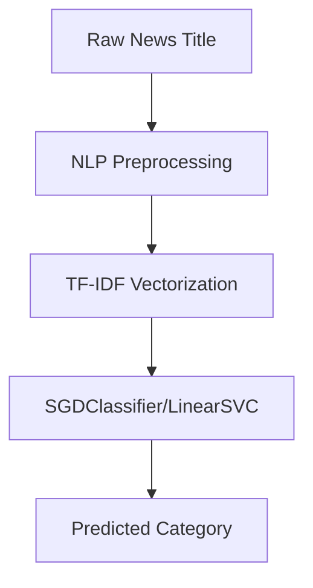

# News Categorization using Title-Based Text Analysis

[](https://github.com/Samyan1Sharma/News-Categorization)
[](https://github.com/Samyan1Sharma/News-Categorization/blob/main/LICENSE)
[](https://github.com/Samyan1Sharma/News-Categorization/blob/main/CONTRIBUTING.md)


A high-performance Machine Learning pipeline designed to categorize news articles using **only titles**. By bypassing full-text analysis, this approach reduces computational overhead by 70–80% while achieving a peak accuracy of **97.86%**.

## 📌 Overview
Digital newsrooms face a significant challenge: processing a massive influx of data in real-time. Traditional categorization systems rely on full-text analysis, which is computationally expensive and introduces unnecessary latency. This project shifts the focus to News Titles, which represent the "purest and most structured information" within an article. By optimizing NLP pipelines to extract high-density semantic value from minimal text, this research demonstrates that near state-of-the-art accuracy can be achieved with a fraction of the computational footprint.

## 🚀 Features
* **Real-time Title Analysis**: High accuracy achieved without requiring article bodies.
* **High-Speed Inference**: System supports processing approximately 700 titles per second.
* **Resource Optimized**: Reduces feature dimensionality by 60% and trains 85% faster than full-text methods.
* **Five-category classification**:
  - 💼 `Business`
  - 🏛️ `Politics`
  - ⚽ `Sports`
  - 💻 `Technology`
  - 🎬 `Entertainment`

## 🎯 Objectives
* **Efficiency**: Achieve maximum semantic value from minimal text to reduce maintenance costs.
* **Accuracy**: Maintain competitive precision (97.8%+) compared to complex deep learning models.
* **Scalability**: Develop a lightweight solution suitable for resource-limited settings and real-time APIs.

## 📊 Performance Highlights
The **SGDClassifier with TF-IDF** features emerged as the optimal configuration.

| Model | Vectorizer | Accuracy | F1-Score | Training Time | Prediction Time |
| :--- | :--- | :--- | :--- | :--- | :--- |
| **SGDClassifier** | **TF-IDF** | **97.86%** | **0.9785** | **0.0363s** | **0.0014s** |
| **LinearSVC** | **TF-IDF** | 97.59% | 0.9758 | 0.1153s | 0.0008s |
| **Logistic Regression** | **TF-IDF** | 97.59% | 0.9759 | 1.5440s | 0.0014s |
| **Multinomial NB** | **BoW** | 97.32% | 0.9731 | 0.0173s | 0.0037s |
| **Random Forest** | **TF-IDF** | 96.51% | 0.9650 | 2.5368s | 0.0797s |

> *Full performance benchmarks conducted on the BBC News dataset (1,490 articles).*

## 🛠️ Technical Stack




## 📦 Technical Implementation

### **Dataset**
* **Source**: BBC News Train dataset.
* **Size**: 1,490 news entries.
* **Split**: 75% Training (1,117 articles) and 25% Testing (373 articles).

### **Preprocessing Workflow**
The system standardizes raw titles through the following steps:


* **Lowercasing**: Ensures uniform character case for analysis and simplifies text analysis.
* **Punctuation Removal**: Filters out computational noise to simplify textual data.
* **Tokenization**: Splits titles into separate word units/tokens.
* **Stopword Removal**: Drops common words like "a", "the", and "is" to improve efficiency and accuracy.
* **Text Stemming**: Reduces words to their base form by removing prefixes and suffixes to standardize the word.

### **Feature Extraction**
* **TF-IDF**: Prioritizes category-defining words by weighting importance relative to the corpus.
* **Bag-of-Words (BoW)**: Simple frequency-based count method used for baseline comparison.

---

## 🧪 Usage Example

```python
import pickle

# Load the re-trained LinearSVC model optimized with TF-IDF
model = pickle.load(open('news_classifier.sav', 'rb'))

# Example title inference 
sample_headline = "Microsoft released new Laptop."

# The prediction routine handles preprocessing automatically 
prediction = predict_news_category_best(sample_headline)

print(f"Category: {prediction}") 
# Output: Tech
```

## 🤝 Contributing
Contributions are welcome! This project follows a multidisciplinary approach combining **NLP**, **Data Science**, **AI/ML**, and **Media Studies**. Please see the `CONTRIBUTING.md` and `CODE_OF_CONDUCT.md` for details.

---

## 📜 License
This project is licensed under the **MIT License** - see the `LICENSE` file for details.

---

## 🙏 Acknowledgments
- Thanks to all contributors who have helped make this project possible
- Special thanks to the open-source community for their invaluable tools and libraries
